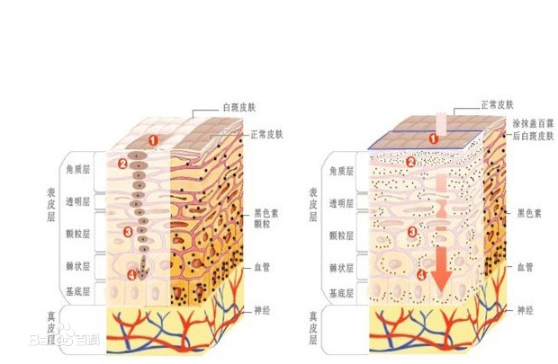
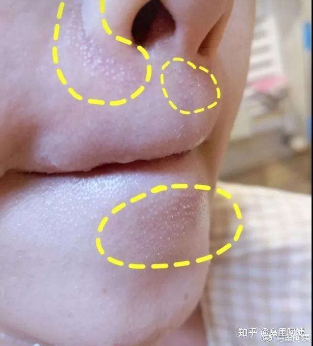
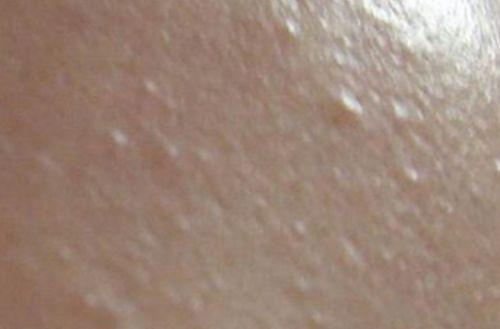
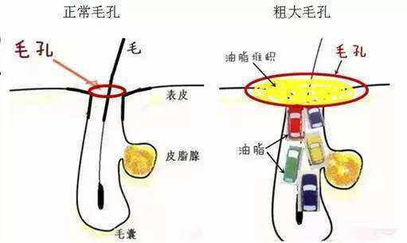
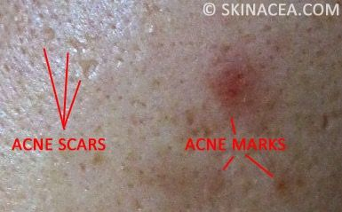
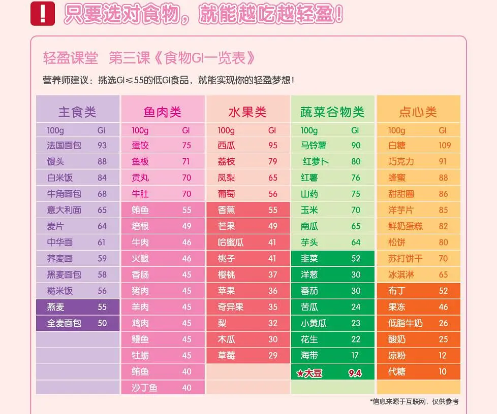
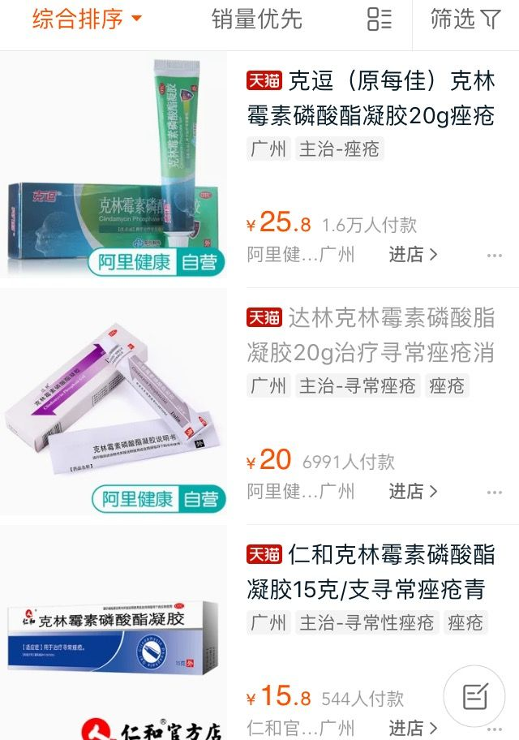
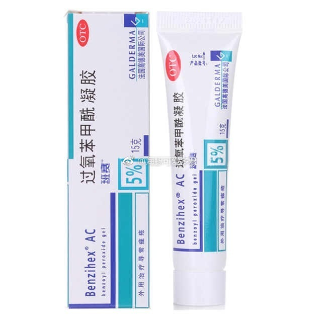
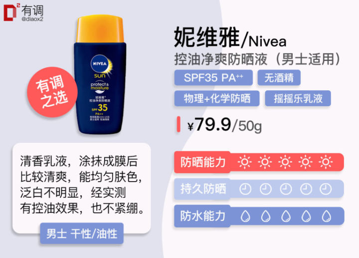
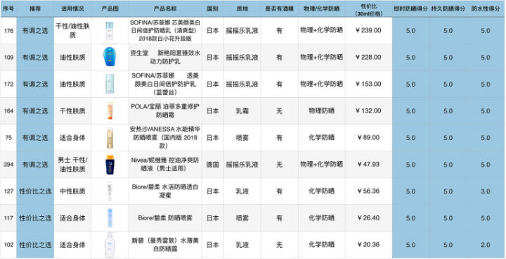

# 护肤入门

[TOC]

## 原则

- 不看产品看成分
- 平民百姓可负担
- 在不太勉强调理的条件下，改善状况
- 得出针对自己有效且可行的方法/措施

## 词汇辨识

### 面膜

面膜这东西，偶尔用一用就好了，不要沉迷于自己敷完面膜之后的美貌，因为那都是暂时的。加上大部分面膜本身是没啥锁水力的，如果后续没有使用具有锁水效果的护肤品，那这面膜能维持的时间是很短的。面膜并不推荐作为必备护肤品，因为日常补水保湿，主要还是要靠乳液、膏霜质地的产品。即使是面膜狂热爱好者，敷面膜- -周最好也不要超过3次，每次时间15min左右足矣,毕竟，咱们不是金鱼，不需要天天让皮肤泡在水里哈。

> 面膜真的有用吗，有科学依据吗？ - 墨墨daisy的回答 - 知乎 https://www.zhihu.com/question/19679849/answer/948708240

### 角质层

[角质层](https://baike.baidu.com/item/角质层)（stratum corneum, Latin for 'horny layer'）是[表皮](https://baike.baidu.com/item/表皮)最外层的部分，主要由 10 至20 层扁平、没有[细胞核](https://baike.baidu.com/item/细胞核/601964)的死亡细胞组成。当这些细胞脱落时，底下位于[基底层](https://baike.baidu.com/item/基底层/1587233)的细胞会被推上来，形成新的角质层。

以人类的前臂为例，每平方厘米表皮在每小时会有 1300 个角质层细胞脱落，形成微尘。会脱落的角质层外层又称为分离层（stratum dysjunction）。

角质层是[表皮](https://baike.baidu.com/item/表皮/3244001)最外层，由已死亡的无核角质细胞（cornocytes）  组成。

角质层的主要作用是保护其皮下组织，防止皮下组织遭受感染（infection），脱水（dehydration）以及抵抗化学（chemical）和外力（mechanica）所带来的压力。

角质层的细胞内含有[角蛋白](https://baike.baidu.com/item/角蛋白/1479940)（keratin） 。它有助减少水份蒸发，甚至能吸收水份，使皮肤保持湿润。由于角蛋白的吸水作用，不少动物 （包括人类在内） 的皮肤在浸泡于水中一段时间后会出现[起皱](https://baike.baidu.com/item/起皱/10631259)的现象。角质层一般介乎 10 至 40 微米不等，取决于其对应的身体部份需要多少保护。

### 角质化

表皮细胞会依基底细胞→棘层细胞→颗粒层细胞→角质层细胞的顺序形态集资转变，并向表层逐渐移动，最后变成角质细胞。这种表皮细胞的分化过程叫做“角质化”。

### 脂肪粒

是不是只听说过眼周长脂肪粒？其实它也可能长在下巴。为什么下巴会长脂肪粒呢？

①皮脂腺分泌过多油脂形成堆积，毛孔堵塞无法排出，导致油脂粒硬化

②毛囊皮脂腺的表皮内部聚集了大量的角质化残留物，形成了脂肪粒

这种情况最重要的就是去除老化角质，疏通毛孔，然后控油！

可以适当的使用去角质产品，去除面部肌肤老化角质层和死皮

敏感肌要注意去角质不要太勤，一般一周一次就可以！

### 闭口

《皮肤外科》书上的解释：闭口是属于痤疮中的一种，从源头来说，我们大部分人都是从青春期便开始长痤疮，这段时期雄激素水平快速升高，而体内酶使雄激素内的睾酮转化为高活性的二氢睾酮，再与皮脂腺细胞的雄激素受体结合发挥作用，引起皮脂腺细胞的增生和皮脂分泌的增多，影响毛囊皮脂腺导管角化。

在毛囊漏斗下部的角质形成细胞不易脱落，**导致角化速度加快，毛囊皮脂腺导管堵塞，皮脂排出障碍，最终形成微粉刺**，此时的粉刺属于非炎症型皮损。但如果再被痤疮丙酸杆菌或者其他细菌感染，则会演化成炎症型痤疮，留印的机率也会增大。

简单来说，便是激素影响了体内的各个微转化，导致皮脂分泌增多和皮肤增生，角化速度加快，层角质将导管堵塞了之后，增多的皮脂没有办法排出，那么便会一直不断堆积，形成了我们平时可见的皮肤部分突起，但是却没有开口的痕迹，也就是大家说的闭口。

**从这样的解释当中，我们能够发现想要去除闭口有2个问题需要认真解决：**

1、问题的本质：激素水平的变化、但这只是原因之一，另外还有高温环境、多糖多脂饮食等。(这儿先不多说，详情看后面)

2、闭口的表象：角质层增生过厚，导致已经生成的粉刺无法处理。

看到这里我们来想想解决方式，如果先处理1，已存在的闭口依旧无法解决；说先处理2，没解决源头问题，闭口数量还是会不断增加。因此，正确祛除闭口的方式应是：同时解决1+2！

> 作者：乌里阿姨
> 链接：https://www.zhihu.com/question/27184601/answer/473355284
> 来源：知乎
> 著作权归作者所有。商业转载请联系作者获得授权，非商业转载请注明出处。

**内源因素**：受内在雄激素刺激皮脂腺分泌增大，毛囊口角化异常堵塞毛孔出口，油脂分泌不出去形成角栓闭口。

**外在因素**：油皮使用过于油腻厚重高封闭性的护肤品。长期敷面膜。含大量刺激成分的护肤品。

### 黑头

黑头其实就是皮脂、细胞屑、细菌全部堵在你的毛孔里面的粉刺，因为外部粉尘污垢加上空气氧化变黑，很多人为了去黑头尝试了各种产品和方法，以为拔出黑头就没事了，但是黑头是拔不干净的，因为问题出在毛孔上面。

### 痘印/痘坑

左边是痘痕，右边是痘印

**痘印**是残留后的印记，一般不凹陷或隆起，分为两种。

\1. 红色的痘印：上图右上。红色痘印不伴随皮肤结构的变化, 不出现隆起或凹陷的瘢痕，它是皮肤炎症反应后期遗留的暂时性痕迹。一般会在半年内逐渐消失。

**对策：抑制炎症，促进皮肤修复。**

\2. 深色痘印：上图右下。是皮肤被炎症刺激后遗留的色素沉着，除非处理否则不会自行消失。

**对策：淡化色素，加速表皮替换。**

具体你可以采用以下方法：

**1.防晒**

**2.


去角质**

> 作者：李叨叨
> 链接：https://www.zhihu.com/question/27496100/answer/135115507
> 来源：知乎
> 著作权归作者所有。商业转载请联系作者获得授权，非商业转载请注明出处。

> 宁愿让痘痘自己花开花谢，也不能自己去暴力挤按。
>
> 痘坑都需要多次治疗，需要恒心、耐力及人民币。
>
> 如何去除脸上的痘印、痘坑？ - 墨墨daisy的回答 - 知乎 https://www.zhihu.com/question/27496100/answer/401817232

### GI

GI值是指血糖生成指数(Glycemic Index)，是反映食物引起人体血糖升高程度的指标。说人话就是你吃完某食物之后两小时，体内血糖水平的上升。

它是用于测量食物的消化和吸收的速率及对血糖的影响。

拿50G燕麦和50G米饭举例，低GI的燕麦在摄入后血糖会缓慢升高。高GI的米饭，糖分消化吸收的速度快， 短时间内的血糖会迅速上升。

按照食物对血糖的影响和食物血糖生成指数(GI)，可将食物分为三个等级： 

- 低GI食物：GI<55

- 中GI食物：GI 55～70 

- 高GI食物：GI >70

摄入大量蛋糕、高糖饮料、巧克力这样的高GI食物，会造成胰岛素分泌或作用异常， 使雄激素增加。从而刺激皮脂腺，引起皮肤长痘。

> 作者：痘痘君滚蛋吧
> 链接：https://www.zhihu.com/question/303584561/answer/634919044
> 来源：知乎
> 著作权归作者所有。商业转载请联系作者获得授权，非商业转载请注明出处。

### GL

GL=（Glycemic Load 升糖负荷）—— 是衡量食物中碳水化合物的质量(GI值)和数量(克每份)的指标。也就说GI仅表明某种碳水化合物转为血糖的速度，但未考虑到摄入量对血糖的影响。而GL则为更全面的概念，它同时兼顾了食物的升糖指数、摄入量对血糖的影响。

一粒糖 虽然GI高，但是量少，吃少点没什么问题 吃多了就不行。

> 作者：痘痘君滚蛋吧
> 链接：https://www.zhihu.com/question/303584561/answer/634919044
> 来源：知乎
> 著作权归作者所有。商业转载请联系作者获得授权，非商业转载请注明出处。

（但是对于吃食堂的普通学生来说，吃饱还是一个重要的事情。严格控制对我个人而言不现实。）

## 成分辨识

### 通用原则

- 微量元素/维生素等只会轻微影响内分泌状况（因为合理饮食的情况下不会很缺某种元素），对皮肤质量的影响非常间接。（合理饮食包括，荤素搭配，丰富水果）（而且如果你的皮肤问题只是因为缺乏某种元素/维生素的话，通过额外补充应该很快就能见效···事实上并不会这样）

### 酒精

首先要明确的是，适当的酒精确实能起到消毒杀菌的作用。所以你用（手贱）手抠痘痘之后，用酒精擦，是正确的。不过应选用75％的酒精从而达到杀菌的目的。

用酒精洗脸有什么后果？可以达到去痘的目的吗？ - 啊LOW的回答 - 知乎 https://www.zhihu.com/question/24928861/answer/29526994

然后酒精在化妆品里起什么作用呢？

它有**收敛蛋白，控油**的作用。

所以，在控油产品等针对油性肌肤的清爽的产品中，可以看到酒精的身影。

其次，**酒精是一种很好的增溶剂**。

产品外观大大提升。所以，一些透明的水剂类产品里，你会看到酒精。

而其实酒精最大的作用是，**一种很好的促渗透剂。**化妆品要起到真正的美白，祛斑等效果，功效成分一定要能够渗透进入皮肤角质层才能发挥功效。而酒精，就可以帮助其渗透到角质层。

还有，**高含量的酒精还具有杀菌的作用**，20%以上的酒精添加的产品中就不需要另外加防腐剂了。

至于安全性，酒精是作为**国家化妆品卫生安全规范中所允许的添加成分**，并且在世界上任何一个国家都是被允许的化妆品成分。

而一些防腐剂，防晒剂等这些成分在一些国家和地区是被**禁止或是限用的**。而重金属类在哪里都是被禁止添加使用的。

所以，其实酒精比很多的防腐剂要安全地多。

不过，必须清楚的是，酒精容易引起皮肤干燥，高浓度的酒精对于肤质是**轻干、重干、轻敏、重敏（要是不清楚自己的肤质，欢迎到美丽修行app上去测一下）**的宝宝就不太友好，可能会对皮肤产生刺激和不适，就避免使用啦。而且不要经常用来湿敷！！！

> 作者：一修姐
> 链接：https://www.zhihu.com/question/29381304/answer/168280341
> 来源：知乎
> 著作权归作者所有。商业转载请联系作者获得授权，非商业转载请注明出处。

### 水杨酸

#### 水杨酸的分类

传统水杨酸: 需要添加强碱中和，提升PH值，代价是水杨酸效果下降。代表品牌:宝拉珍选;

辛酰水杨酸:它是一种加以脂链的水杨酸的衍生物，PH值5.5，接近肌肤酸碱值，不刺激皮肤，但也就弱化了一些水杨酸的功能和效果。代表品牌:理肤泉;

β-环糊精包结: 6小时只能释放40%，功效有限;

壳聚糖包结: 6小时释放能够50%，相比β-环糊精包结有所提升，但仍然有限;

很多人认为刷酸就一定会导致角质层变薄，皮肤变得敏感。其实不然，比如博乐达是**双向调节角质层**，在2%浓度时促使角质生成，大于5%则剥脱角质，是敏感肌也可以使用的祛痘产品。而且博乐达使用超分子缓释技术，简单来说就是，在你脸上慢慢地释放水杨酸，而不是敷上去就是敷上去了。

> 作者：B12
> 链接：https://www.zhihu.com/question/344422152/answer/814298962
> 来源：知乎
> 著作权归作者所有。商业转载请联系作者获得授权，非商业转载请注明出处。

### 葡萄糖酸锌

临床上适用于小儿厌食症、各种皮肤痤疮、复发性阿弗口腔溃疡等缺锌性疾病。

微量元素补充只是会轻微影响内分泌状况，对皮肤质量的影响非常间接。

缺锌对皮肤质量有一定的影响（但不是绝对影响）。不会增加油脂的分泌，而是导致皮肤的干裂缺水。会影响胃肠功能紊乱，食欲不振，甚至于发育异常，性腺的发育异常，所以缺锌的话一定要及时的补充。葡萄糖酸锌口服液，就是钙铁锌片，或者是多种维生素，微量元素的复合制剂都可以。

> [市场上的葡萄糖酸锌口服液是否真的有用? - 知乎](http://www.baidu.com/link?url=KxhNZWgXT-iUwOv-bn_9mKNJbNZ3jkefO_EIvgqv4Pg8VzQxeUhGAPbtXZzHesUYAzAMNaOSTWIVketIDldDU_&wd=&eqid=c035324e0009a065000000045e54790e)
>
> 葡萄糖酸锌是有机锌，它们是弱酸弱碱盐，和胃酸结合，会产生氯化锌，对人体造成很大的危害。同时葡萄糖酸锌含锌量较高，会拮抗钙铁等营养素的吸收。长期服用会导致缺钙、贫血、眼线浮肿等危害。
>
> 生物蛋白锌—(例如)新稀宝牌锌硒宝片。不会拮抗钙铁等营养素的吸收。生物蛋白锌纯生物剂，高活性易吸收。（有一定广告性质）

### 维生素B6

（注意：是指由于缺乏而可能导致的）一般疾病：

1、动脉硬化、2.秃头、3.胆固醇过高、4.[膀胱炎](https://baike.baidu.com/item/膀胱炎)、5.面部油腻、6.[低血糖](https://baike.baidu.com/item/低血糖)症、7.精神障碍、8.肌肉失调

“维生素B族的强大祛痘痘功能”如此的口号不可信。

### 过氧苯甲酰凝胶

### 异维A酸胶

### 雄性激素

**雄激素**是一类含19个碳原子的类固醇激素，体内的雄激素主要有睾酮、双氢睾酮，雄烯二酮，去氢表雄酮，去氢表雄酮硫酸盐等。

雄激素性脱发又称脂溢性脱发，主要是因为毛囊内双氢睾酮（DHT）在前额和头顶增加导致。强力的DHT进入头发毛囊对毛囊代谢系统产生作用。尤其具有细胞能量作用的ATP物质的制造会因此而受阻。作为热量源的ATP无法产生出来，因而无法进行毛发的蛋白合成，毛母细胞失去活力，开始角质化，终于成为休止期毛发。

雄激素性脱发又称脂溢性脱发，主要是因为毛囊内双氢睾酮（DHT）在前额和头顶增加导致。强力的DHT进入头发毛囊对毛囊代谢系统产生作用。尤其具有细胞能量作用的ATP物质的制造会因此而受阻。作为热量源的ATP无法产生出来，因而无法进行毛发的蛋白合成，毛母细胞失去活力，开始角质化，终于成为休止期毛发。

> 作者：徐鲁
> 链接：https://www.zhihu.com/question/34586594/answer/624021998
> 来源：知乎
> 著作权归作者所有。商业转载请联系作者获得授权，非商业转载请注明出处。

（当然护发是另一个主题了···）

#### 雄性激素与健身

>[健身刺激雄性激素增加，那练肌肉会加重脱发吗](https://zhidao.baidu.com/question/524440072884455605.html)
>
>健身严格说不能刺激雄性激素增加，应该叫可以保持雄性激素水平，或者让雄性激素水平下降的缓慢些。
>
>健身是不可能让你的雄性激素水平超过原来最高的雄性激素水平！
>
>健身对雄性激素的调节作用可能最主要是调节心情。放松愉悦的心情，还有良好的循环，以及好的睡眠，是保持雄性激素的关键。压力烦扰，睡眠不佳，饮食不当，抽烟喝酒，是很多人体内雄性激素下降的主要原因。
>
>那些肌肉块很大的人，不一定体内的雄性激素就多。

## 衍生问题

如何检测自身微量元素？

## 产品建议

### 阿达帕林凝胶

阿达帕林是第三代维A酸，在疗效和耐受性上都较其他维A酸类药物明显提高。适合轻中度的一般性（黑头、白头、微红肿）痤疮。

痤疮（青春痘）外用药使用指南 - 姚庆君的文章 - 知乎 https://zhuanlan.zhihu.com/p/37515239

局部用药，用无菌棉签或牙签头沾取阿达帕林，涂在长痘的地方。

#### 涂阿达帕林反而“爆痘”正常吗？还能继续用吗？（存疑）

**姚庆君：**阿达帕林的作用是溶解和排出粉刺，而白头粉刺往往是被封闭在皮肤里面的，也就是闭合性粉刺，用药后粉刺一旦溶解又不能顺利被排出时，就会刺激周围的皮肤出现炎症，然后形成痘痘，也就是所谓的“爆痘”，这是用了阿达帕林的正常情况，不用因此停药。

### 克林霉素磷酸酯凝胶

抗生素

[缺点] :

1. 容易耐药，因为耐药性的发展，个人建议连续使用不要超过1个月。一般是不建议单独使用抗生素治疗痤疮。
2. 它对于非炎症性痤疮比如:闭口，粉刺，头几乎无效的。

3. 有极少量文献报道克林霉素会弓|起腹泻或者艰难梭菌相关性肠炎，不过概率极低。所以有肠炎,溃疡性结肠炎患者严禁使用，可以更换夫西地酸乳膏或者班赛。

[优点] :

1. 价格便宜，你如果皮肤敏感的话，因为它的耐受性极佳，对皮肤几乎没有任何刺激。

2. 克林霉素为孕B类药物，备孕或者怀孕女性也可以比较安心使用，怀孕长痘也要简单治疗啊。

[用法]

   局部外用，用温水洗净患处，轻轻擦干后，取适量凝胶在患处涂一薄层,每日早晚各1次。但是海豚君个人建议:

   1.晚上使用维A酸类，天使用克林霉素凝胶。因为维A酸类不是抗生素也不是激素,但它改善毛孔.角栓堵塞，更加有利于抗生素渗透皮肤内部抗菌治疗痤疮,可以提高抗生素的疗效。

   2.白天单双日交替使用过氧化甲酰凝胶(班赛)和克林霉素凝胶，比如:星期-使用班赛,星期二使用克林霉素凝胶,交替使用可以减少班赛的刺激和色素沉着，也可以增加抗生素克林霉素的药效，减少耐药菌株的产生。

### 班赛/过氧苯甲酰凝胶

1.对于班赛其实更应该称为班赛AC。AC是丙烯酯共聚体微粒的简称。这种微粒的最大特点是可以吸附大量的脂类、甘油和水等液态物质，并且由于对不同的物质吸附能力不同，所以在皮肤表面可以用甘油置换皮脂。这就是白色微粒的来源之一。

2.AC制剂技术使班赛清除皮脂的能力与普通过氧化苯甲酰凝胶相比增强了1倍。而且班赛可以用预置的甘油置换皮肤表面的皮脂，来保持皮肤的湿度，通过湿化皮肤来降低过氧化苯甲酰对皮肤的干燥和脱屑刺激。简单说，释放保湿因子甘油，减轻对皮肤的刺激，同时AC制剂，可以让有效成分稳定释放，减少了大量药物立即接触皮肤引起的刺激反应。这就是相对温和的原因之一。

3.班赛AC制剂的另一个特点是不含乙醇，更减少了制剂的刺激作用。临床应用表明，相同浓度的普通过氧化苯甲酰凝胶与班赛相比，疗效相近的情况下，班赛的副反应发生率仅为普通制剂的50%左右。

4.含过氧苯甲酰成分的药膏或者护肤品很多，但是能做到相对温和不刺激，也只有大厂高德美（欧莱雅+雀巢合资）独有专利技术才能做到。同样护肤品也是如此，含烟酰胺成分的护肤品很多，但是做的比较好的还是宝洁，原料桶也只能看看而已。

### 夫西地酸乳膏

药店一般卖两种夫西地酸乳膏：一个叫奥络（国产版），一个叫立思丁（进口版），进口版更贵更好点，不论哪款，我们都可以放心使用。夫西地酸乳膏的祛痘原理：夫西地酸乳膏通过抑制细菌的蛋白质合成而产生抗菌作用。它用于正常皮肤渗透进皮肤的量很低，但是在病理条件下，却能深入皮肤，进入病灶。

夫西地酸乳膏，属于抗生素类，但是现在研究它几乎没有耐药性，如果害怕耐药，我们单用不要超过3个月即可。

> 作者：海豚可爱多君
> 链接：https://zhuanlan.zhihu.com/p/26104171
> 来源：知乎
> 著作权归作者所有。商业转载请联系作者获得授权，非商业转载请注明出处。

### 防晒霜

防晒的作用其实不只是防止晒黑，还有防止破损的皮肤受到过多紫外线影响。因为新生新生的皮肤是比较脆弱的，而且更容易晒黑，留下局部深色。（比如痘痘破掉的时候）

对我来说，求没味儿，而且不堵塞毛孔就行。

有测评：

学生党选择什么防晒霜好？便宜而且防晒效果好？ - 有调App的回答 - 知乎 https://www.zhihu.com/question/56114401/answer/409320741

我稍微相中这款：

### 洁面乳

有哪些平价又好用的洗面奶? - Vivianus的回答 - 知乎 https://www.zhihu.com/question/36784523/answer/228973379

### 凡士林

凡士林有何妙用？ - 莫嫡 Morettie的回答 - 知乎 https://www.zhihu.com/question/20652657/answer/129586017

这款凡士林经典修护晶冻 只适合正常肌肤（油皮及油痘皮不适合）， 敏感肌肤不能用，敏感肌肤不能用，敏感肌肤不能用。

①涂在鼻腔内膜避免因太干燥而流血，或鼻出血的人可以涂在鼻孔内壁阻止继续出血。

②感冒时涂在鼻子周围的皮肤上以免擤鼻涕过多摩擦变红。

⑤使伤口部位的皮肤组织湿润并减少空气接触，保持自身修复能力较高的状态，不易留疤。涂在小伤口或轻微的烫伤可以有止血、减缓疼痛的效果。

## 调理结论

- 定期去正规医院检查。
- 不要用手直接处理痘痘。
- 奶茶蛋糕不天天吃，是我的控糖底线了吧。
- 在枕头上方廉价毛巾，重在勤换洗，枕头套可以频率低一点。
- 如果有破口，可以用抗生素类药膏或者**凡士林**涂抹覆盖，有伤口需要防晒。

目前想到的不错的佛系且便宜的药物方案（不破百）：

- **阿达帕林凝胶**，晚上，点涂痘痘/粉刺/闭口明显处（是酸类，会有刺激反应，前几次用可以少量，慢慢适应）。
- **夫西地酸**和**克林霉素**间隔瞎涂（因为是抗生素，做个抑菌作用）。
- 凡士林：[Vaseline 凡士林 正宗经典修护晶冻 100g](https://www.smzdm.com/p/9617661/)19.8
- 洁面乳：旁氏米粹润泽洁面乳(21)

比较昂贵精致的护肤品（对我而言）方案：

- 防晒霜：[妮维雅 控油净爽防晒液SPF30PA++](https://cosme.pclady.com.cn/product/113426.html) （79）
- 酸刷向：[博乐达](https://mall.jd.com/index-813885.html)产品（预算300 - 500）

## 参考

[如何让皮肤变好？](https://www.zhihu.com/question/28259314/answer/156186395)

有哪些误导性护肤理念/有哪些鲜为人知的正确护肤理念？ - 霞外籠逗留的回答 - 知乎 https://www.zhihu.com/question/31370246/answer/156056474

有哪些误导性护肤理念/有哪些鲜为人知的正确护肤理念？ - 墨墨daisy的回答 - 知乎 https://www.zhihu.com/question/31370246/answer/264779035